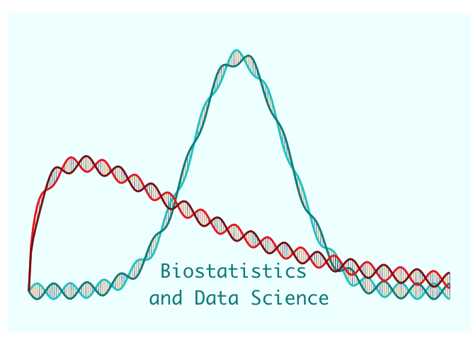
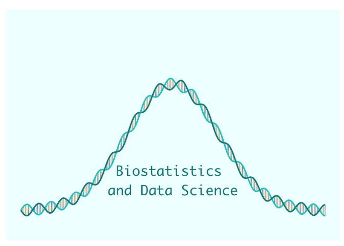
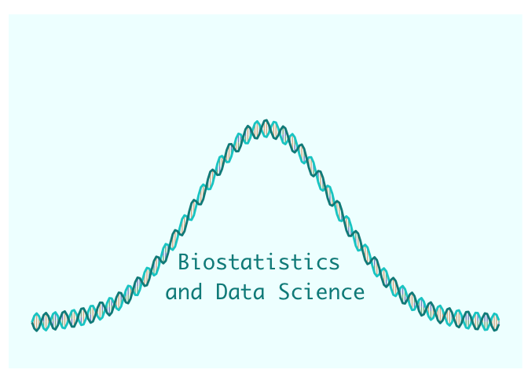
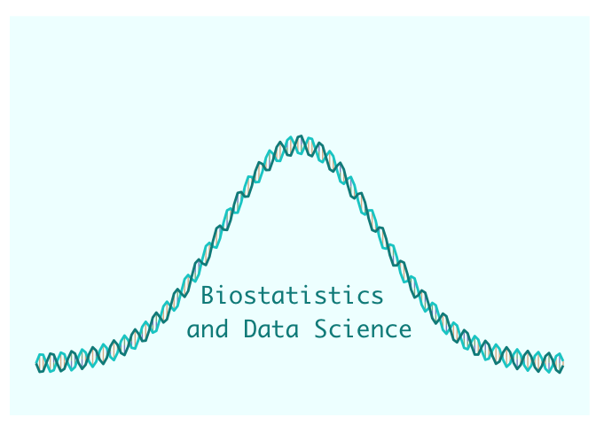
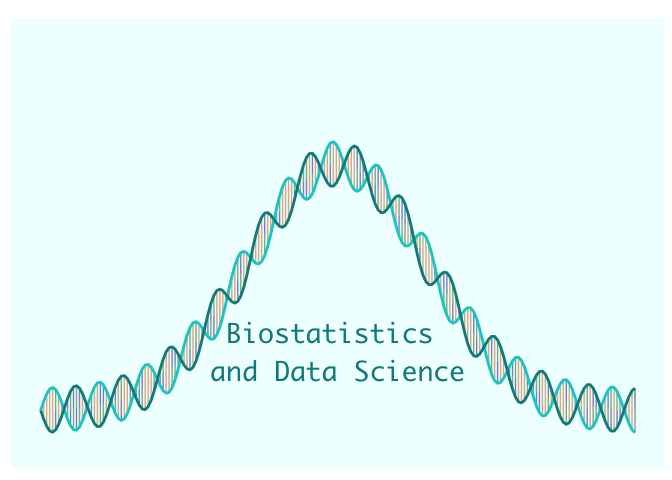

Double Helix Distribution Figure
================

For years I had this idea to create a biostatistics themed “logo” based
on a statistical PDF curve formed from a DNA double helix. I have
limited graphic design skills, but I know R pretty well. So I decided to
program it and plot it with ‘ggplot2’. It’s a pretty basic function with
relatively self-explantory parameter inputs. Right now it can plot a
Normal of Chisq distribution. Depending on how large of an image
(i.e. pixel density) you want, you may have to play around with the
axes, amplitude and frequency paramaters to get it to look right. You
can also edit the color of the strands, basepair colors, and background
color. Here’s the code for the primary function:

``` r
# Generate Plot
p1 = generate_plot(Norm=T, #Logical: Show normal distribution
                   Chisq=T, #Logical: show Chi-Square distribution
                   norm_vals = c(4, .9), #vector of mean and sd for Normal dist (ignored if Norm=F)
                   chisq_vals = c(3,0 ), #vector of DF and non centrality for chi-sq (Ignored if Chisq=F)
                   amp=0.015,  #amplitude of SIN wave to create double helix; adjusts height of strand
                   freq=10, #frequency of SIN wave to create double helix; adjusts width of strands
                   bp_density = 200, #how dense the base-pairs between strands appear (200 is default; higher = more dense)
                   xlims= c(0,8), # vector of min and max x-values for distribution generation and plot
                   ylims= c(-0.05, .5),  #vector of y limits for height of plot
                   text="Biostatistics \nand Data Science",  #optional text to add to plot
                   text_pos = c(4,.015), #vector of (x,y) coordinates for text on plot
                   text_size=7
                   #helix_cols = c("cyan3", "cyan4", "firebrick2", "firebrick4"), #color of helix strands
                   #basepair_cols = c("darkorange3", "darkred", "darkblue", "darkgreen"), #color of basepairs connections
                   #background_col = "azure1"
                   )
```

and here is the resulting plot:

<center>

<!-- -->

</center>

Now lets say you want to get rid of the chi-square dist and expand the
variance/SD of the Normal distribtuion. We simply set “Chisq” to F and
increase the SD of the “norm_vals” from .9 to 1.2. Note, chisq_vals will
be ignored.

``` r
# Generate Plot
p1 = generate_plot(Norm=T, #Logical: Show normal distribution
                   Chisq=F, #Logical: show Chi-Square distribution
                   norm_vals = c(4, 1.2), #vector of mean and sd for Normal dist (ignored if Norm=F)
                   chisq_vals = c(3,0 ), #vector of DF and non centrality for chi-sq (Ignored if Chisq=F)
                   amp=0.015,  #amplitude of SIN wave to create double helix; adjusts height of strand
                    freq=10, #frequency of SIN wave to create double helix; adjusts width of strands
                   bp_density = 200, #how dense the base-pairs between strands appear (200 is default; higher = more dense)
                   xlims= c(0,8), # vector of min and max x-values for distribution generation and plot
                   ylims= c(-0.05, .5),  #vector of y limits for height of plot
                   text="Biostatistics \nand Data Science",  #optional text to add to plot
                   text_pos = c(4,.08), #vector of (x,y) coordinates for text on plot
                   text_size=7
                   #helix_cols = c("cyan3", "cyan4", "firebrick2", "firebrick4"), #color of helix strands
                   #basepair_cols = c("darkorange3", "darkred", "darkblue", "darkgreen"), #color of basepairs connections
                   #background_col = 'azure1'
                   )
```

and here is the plot:

<center>

<!-- -->

</center>

Now let’s say we want the width of each double-helix pattern to be more
“scrunched” together, we can increase the frequency parameter ‘freq’
from 10 to 20.

``` r
# Generate Plot
p1 = generate_plot(Norm=T, #Logical: Show normal distribution
                   Chisq=F, #Logical: show Chi-Square distribution
                   norm_vals = c(4, 1.2), #vector of mean and sd for Normal dist (ignored if Norm=F)
                   chisq_vals = c(3,0 ), #vector of DF and non centrality for chi-sq (Ignored if Chisq=F)
                   amp=0.015,  #amplitude of SIN wave to create double helix; adjusts height of strand
                    freq=10, #frequency of SIN wave to create double helix; adjusts width of strands
                   bp_density = 200, #how dense the base-pairs between strands appear (200 is default; higher = more dense)
                   xlims= c(0,8), # vector of min and max x-values for distribution generation and plot
                   ylims= c(-0.05, .5),  #vector of y limits for height of plot
                   text="Biostatistics \nand Data Science",  #optional text to add to plot
                   text_pos = c(4,.08), #vector of (x,y) coordinates for text on plot
                   text_size=7
                   #helix_cols = c("cyan3", "cyan4", "firebrick2", "firebrick4"), #color of helix strands
                   #basepair_cols = c("darkorange3", "darkred", "darkblue", "darkgreen"), #color of basepairs connections
                   #background_col = 'azure1'
                   )
```

and here is the plot:

<center>

<!-- -->

</center>

Now let’s space out the base-pairs segments a little bit by lessening
the “bp_density” parameter from 200 to 150

``` r
# Generate Plot
p1 = generate_plot(Norm=T, #Logical: Show normal distribution
                   Chisq=F, #Logical: show Chi-Square distribution
                   norm_vals = c(4, 1.2), #vector of mean and sd for Normal dist (ignored if Norm=F)
                   chisq_vals = c(3,0 ), #vector of DF and non centrality for chi-sq (Ignored if Chisq=F)
                   amp=0.015,  #amplitude of SIN wave to create double helix; adjusts height of strand
                    freq=10, #frequency of SIN wave to create double helix; adjusts width of strands
                   bp_density = 150, #how dense the base-pairs between strands appear (200 is default; higher = more dense)
                   xlims= c(0,8), # vector of min and max x-values for distribution generation and plot
                   ylims= c(-0.05, .5),  #vector of y limits for height of plot
                   text="Biostatistics \nand Data Science",  #optional text to add to plot
                   text_pos = c(4,.08), #vector of (x,y) coordinates for text on plot
                   text_size=7
                   #helix_cols = c("cyan3", "cyan4", "firebrick2", "firebrick4"), #color of helix strands
                   #basepair_cols = c("darkorange3", "darkred", "darkblue", "darkgreen"), #color of basepairs connections
                   #background_col = 'azure1'
                   )
```

and here is the plot:

<center>

<!-- -->

</center>

And lastly, let’s say we want the height of the strand to increase, we
can increase the amplitude parameter ‘amp’ from 0.015 to 0.030.

``` r
# Generate Plot
p1 = generate_plot(Norm=T, #Logical: Show normal distribution
                   Chisq=F, #Logical: show Chi-Square distribution
                   norm_vals = c(4, 1.2), #vector of mean and sd for Normal dist (ignored if Norm=F)
                   chisq_vals = c(3,0 ), #vector of DF and non centrality for chi-sq (Ignored if Chisq=F)
                   amp=0.03,  #amplitude of SIN wave to create double helix; adjusts height of strand
                    freq=10, #frequency of SIN wave to create double helix; adjusts width of strands
                   bp_density = 200, #how dense the base-pairs between strands appear (200 is default; higher = more dense)
                   xlims= c(0,8), # vector of min and max x-values for distribution generation and plot
                   ylims= c(-0.05, .5),  #vector of y limits for height of plot
                   text="Biostatistics \nand Data Science",  #optional text to add to plot
                   text_pos = c(4,.08), #vector of (x,y) coordinates for text on plot
                   text_size=7
                   #helix_cols = c("cyan3", "cyan4", "firebrick2", "firebrick4"), #color of helix strands
                   #basepair_cols = c("darkorange3", "darkred", "darkblue", "darkgreen"), #color of basepairs connections
                   #background_col = 'azure1'
                   )
```

and here is the plot:

<center>

<!-- -->

</center>
